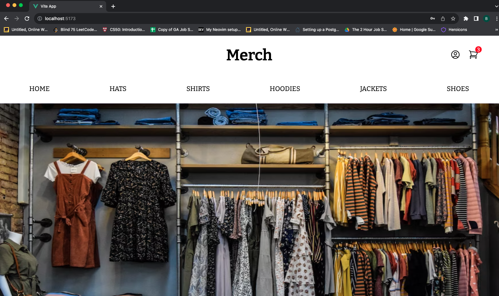
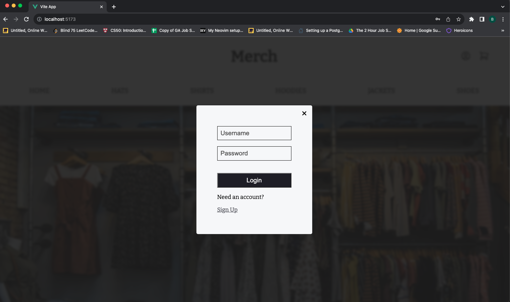
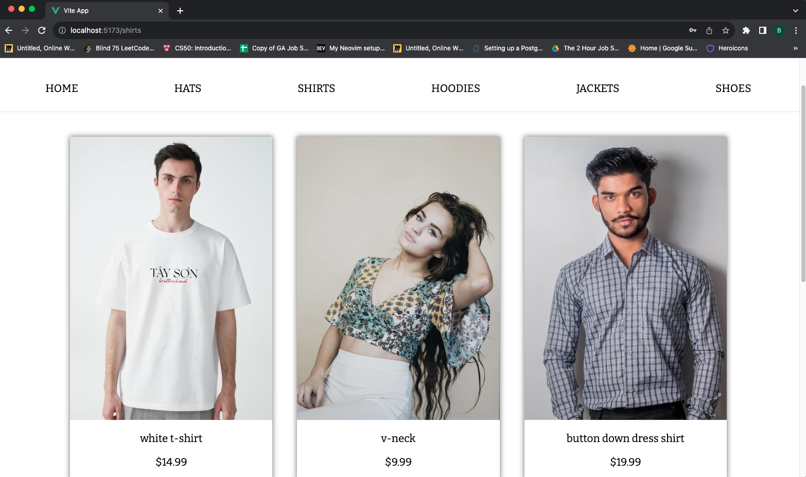
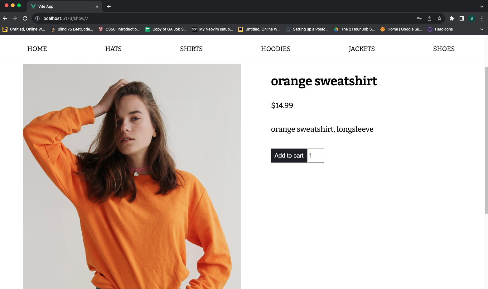
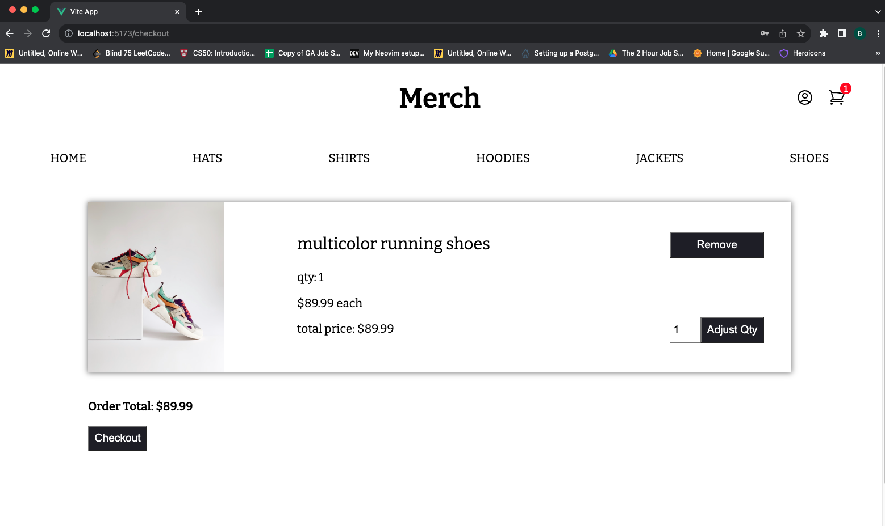

# Merch
I was tired of building MERN apps and decided to try and learn a few new skills so I built an ecommerce website. Merch is pretty much just a dummy ecommerce website that allows users to login, add / remove things from their cart, checkout, view past orders, etc.

## Screenshots

## Technologies Used

- Vue
- Express
- PostgreSQL
- pg-promise

## Getting Started

Click [here](https://merch-kpad.onrender.com/) and you can browse any item you would like. Hover the user icon and click "create account" to begin adding things to your cart. Once you are done, click the cart icon and checkout after making any changes you like.